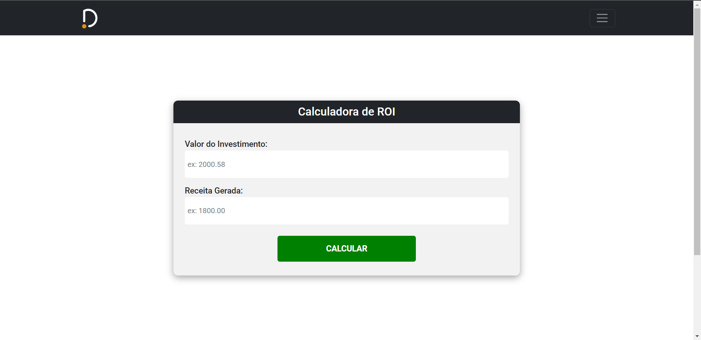

# DevCyber-ROI



> Linha adicional de texto informativo sobre o que o projeto faz. Sua introdução deve ter cerca de 2 ou 3 linhas. Não exagere, as pessoas não vão ler.

## 💻 Pré-requisitos

Antes de começar, verifique se você atendeu aos seguintes requisitos:
<!---Estes são apenas requisitos de exemplo. Adicionar, duplicar ou remover conforme necessário--->
* Você instalou a versão mais recente de `<linguagem / dependência / requeridos>`
* Você tem uma máquina `<Windows / Linux / Mac>`. Indique qual sistema operacional é compatível / não compatível.
* Você leu `<guia / link / documentação_relacionada_ao_projeto>`.

## 🚀 Instalação do Django e Inicialização do Servidor

### Instalação do Django:

Linux e macOS:
```
sudo apt install python3-django
```

Windows:

```
python3 -m pip install django==3
```      


### Inicializando o servidor:

Linux e macOS:
```
python manage.py runserver your_server_ip:8000
```

Windows:
```
python3 .\manage.py runserver
```


## ☕ Usando <nome_do_projeto>

Para usar <nome_do_projeto>, siga estas etapas:

```
<exemplo_de_uso>
```

Adicione comandos de execução e exemplos que você acha que os usuários acharão úteis. Fornece uma referência de opções para pontos de bônus!

## 📫 Contribuindo para <nome_do_projeto>
<!---Se o seu README for longo ou se você tiver algum processo ou etapas específicas que deseja que os contribuidores sigam, considere a criação de um arquivo CONTRIBUTING.md separado--->
Para contribuir com <nome_do_projeto>, siga estas etapas:

1. Bifurque este repositório.
2. Crie um branch: `git checkout -b <nome_branch>`.
3. Faça suas alterações e confirme-as: `git commit -m '<mensagem_commit>'`
4. Envie para o branch original: `git push origin <nome_do_projeto> / <local>`
5. Crie a solicitação de pull.

Como alternativa, consulte a documentação do GitHub em [como criar uma solicitação pull](https://help.github.com/en/github/collaborating-with-issues-and-pull-requests/creating-a-pull-request).

## 🤝 Colaboradores

Agradecemos às seguintes pessoas que contribuíram para este projeto:

<table>
  <tr>
    <td align="center">
      <a href="https://github.com/LucasTMB" target="_blank">
        <br>
        <sub>
          <b>Lucas Teixeira</b>
        </sub>
      </a>
    </td>
    <td align="center">
      <a href="https://github.com/MEduardaOl" target="_blank">
        <br>
        <sub>
          <b>Maria Eduarda Olímpio</b>
        </sub>
      </a>
    </td>
    <td align="center">
      <a href="https://github.com/isabellemaria" target="_blank">
        <br>
        <sub>
          <b>Isabelle Maria</b>
        </sub>
      </a>
    </td>
    <td align="center">
      <a href="https://github.com/Gabrferr" target="_blank">
        <br>
        <sub>
          <b>Gabriel Ferreira</b>
        </sub>
      </a>
    </td>
  </tr>
</table>


## 😄 Seja um dos contribuidores<br>

Quer fazer parte desse projeto? Clique [AQUI](CONTRIBUTING.md) e leia como contribuir.

## 📝 Licença

Esse projeto está sob licença. Veja o arquivo [LICENÇA](LICENSE.md) para mais detalhes.

[⬆ Voltar ao topo](#nome-do-projeto)<br>
